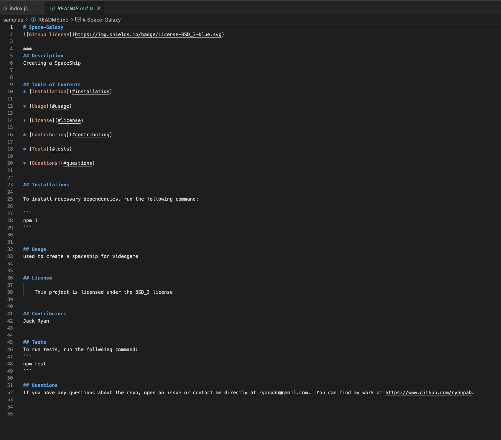

## README_GENERATOR
***

## Description
Creates a README using node and prompts.

## Table of Contents
* [Installation](#installation)

* [Usage](#usage)

* [Contributing](#contributing)

* [Questions](#questions)

## Installation
Node.js
NPM
inquirer

## Usage
This tool is allow the user to create a README.md.  See video and screenshots for details.

1. In integrative terminal mode enter node index.js.

2. The following prompts will appear individually as you answer.

3. Once generated it will be in the samples folder and will look like this:

4.  Right click and chose open Preview and you will be able to see the license badge on the upper left.

## Questions
If you have any questions about the repo, open an issue or contact me directly at rypab4@gmail.com.  You can find my work at https://www.github.com/rypab4.
